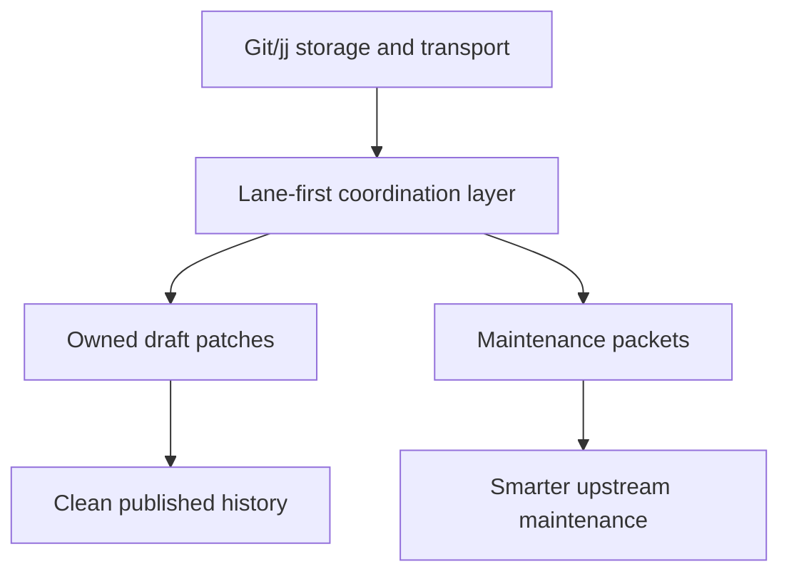
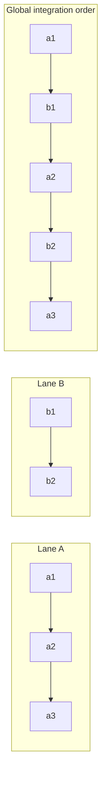
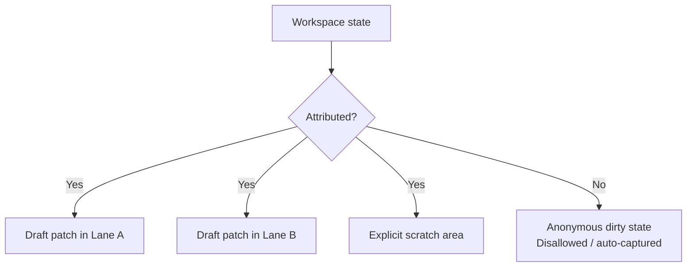
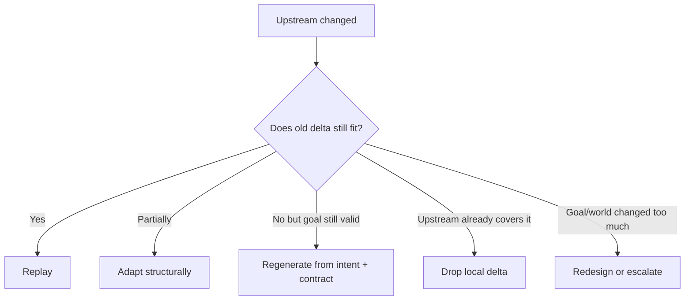
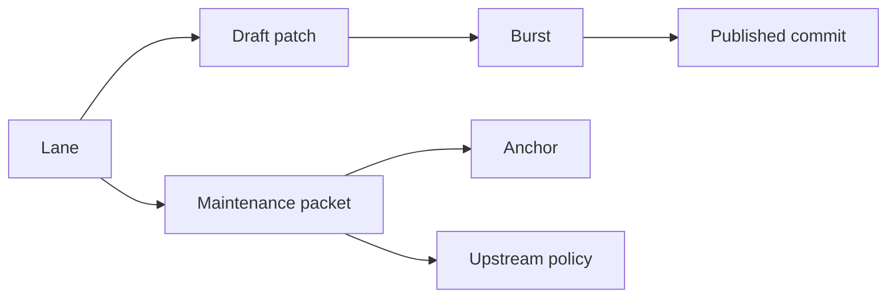

# Agent-Native VCS: Core Behavior

## Status
Draft project note synthesizing the core ideas from this session.

## One-line thesis
This system is **not primarily a better merge algorithm**. It is a Git/jj-layer VCS that preserves the **meaning, ownership, and maintenance context** of local changes so intelligent agents can continuously coordinate with each other and re-maintain local deltas against a moving upstream.

## Core framing
- Git is largely **branch-first**.
- jj is largely **change-first**.
- This system should be **lane-first** and **maintenance-packet-first**.

The underlying storage and transport can remain Git-compatible. The innovation is in the metadata, grouping, and workflows the VCS makes first-class.

## What problem this VCS is solving
There are two related but distinct problems:

1. **Parallel multi-agent editing inside one codebase**
   - Agents work in short bursts of coherent edits.
   - Their work may interleave and may conflict.
   - Anonymous dirty state causes hesitation and contamination.

2. **Long-lived local customization over moving upstream**
   - Users will increasingly maintain personalized downstream variants of open source projects.
   - The hard problem is not patch application; it is preserving the **intent** of the local delta as upstream changes.

## Design goals
1. Make agent work naturally representable.
2. Eliminate anonymous dirty state.
3. Preserve enough context for future agents to maintain local changes against upstream.
4. Keep machine history rich while allowing human-facing history to stay clean.
5. Remain compatible with Git ecosystems and remote hosting.

## Non-goals
- Do not try to replace Git object storage first.
- Do not promise that all major upstream divergence can be automatically resolved.
- Do not depend on raw reasoning traces as the main artifact of understanding.

## Core entities

### 1. Lane
A **lane** is the primary unit of ongoing work.

A lane is usually keyed by:
- `goal`
- `agent`

For downstream maintenance, a lane may instead be a long-lived **customization lane** representing a persistent local delta.

A lane is not just a label. It has:
- local sequence/order
- owned draft state
- provenance
- anchors into code/upstream
- contracts/invariants
- maintenance policy

### 2. Draft patch (or micro-commit)
Every meaningful edit produced by an agent should be captured as an owned, replayable unit.

Properties:
- associated with one lane
- attributable to one agent/model/session
- based on a specific revision
- revertible and replayable
- safe to compact later

This avoids the model of a shared dirty working tree with unclear ownership.

### 3. Burst
Agents often emit several rapid, coherent edits while pursuing one subtask.
A **burst** groups these temporally adjacent draft patches into one operational work episode.

### 4. Published commit
A human-facing commit may be compacted from one or more draft patches or bursts.

This gives a two-level model:
- **operational history** for concurrency and maintenance
- **published history** for human review and sharing

### 5. Maintenance packet
Every local delta should carry a context packet rich enough for future maintenance.

A maintenance packet contains at least:
- intent/goal
- behavioral contract
- semantic anchors
- assumptions
- validation hooks
- provenance
- lifecycle/upstream policy
- concise rationale

### 6. Anchor
An anchor records what upstream concept a lane or patch is attached to.
Examples:
- symbol/function/type
- endpoint
- config key
- UI element
- file region
- protocol/schema field

Anchors are stronger than line-level diffs for long-term maintenance.

## Core invariants

### Invariant 1: No anonymous dirtiness
All uncommitted changes must belong to something:
- a lane
- a draft patch
- a scratch area with explicit ownership

The system should discourage or auto-resolve unattributed dirty state.

### Invariant 2: Capture is separate from publish
Agents should not have to decide immediately whether to create a final human-facing commit.

Instead:
- edits are captured automatically into owned draft units
- publishing/compaction happens later

### Invariant 3: Local meaning matters more than exact old patch shape
For upstream maintenance, the system preserves the **meaning of the delta**, not just its old textual diff.

### Invariant 4: Interleaving is normal
Commits from different lanes may interleave in global history while each lane retains its own local coherence.

## Core behaviors

### 1. Group work by lane, not only by branch
The primary grouping is not a branch but a **lane**.

A lane answers:
- what goal is this serving?
- which agent produced it?
- what code/upstream concepts is it attached to?
- how should it be maintained later?

### 2. Treat edits as owned draft units as soon as possible
When an agent edits code, the system should quickly capture those edits into a draft patch for the active lane.

This avoids:
- commit contamination
- uncertainty about ownership
- fear of losing unrelated work

### 3. Keep dirty state explicit and attributable
If a workspace is not clean, the state should read as something like:
- draft changes for lane A
- draft changes for lane B
- scratch changes owned by session X

not merely "repo dirty".

### 4. Support interleaved global integration
Lanes may be globally interleaved. That is acceptable.

Example:
- Lane A: `a1 -> a2 -> a3`
- Lane B: `b1 -> b2`
- Integrated order: `a1 -> b1 -> a2 -> b2 -> a3`

The system should preserve both:
- local lane order
- global integration order

### 5. Preserve a maintenance packet for each local delta
For each lane/customization, store:
- why it exists
- what behavior must remain true
- what it is attached to upstream
- what assumptions it depends on
- how to test it
- when to drop, adapt, or regenerate it

This is the core enabler for intelligent downstream maintenance.

### 6. Maintenance is replay/adapt/regenerate/drop — not only merge
When upstream changes, the system should help agents decide among:
1. replay the delta
2. structurally adapt the delta
3. regenerate from goal + contract
4. drop because upstream subsumed it
5. redesign because upstream changed the world too much

### 7. Continuous classification matters more than blind merge
For each lane relative to upstream, the system should help classify:
- clean
- drifting
- partially subsumed
- conflicted
- broken
- needs regeneration
- should be dropped
- needs human/product decision

### 8. Published history should stay clean
Machine history can be noisy and fine-grained.
Human history should remain compact, reviewable, and comprehensible.

## What information the VCS should encourage
For each local lane/customization, strongly encourage or require:

### Intent
- why this change exists
- user/stakeholder need
- must-have vs preference
- non-goals

### Behavioral contract
- invariants
- acceptance criteria
- relevant tests
- performance/security/UX constraints

### Semantic anchors
- symbols/types/APIs/config keys/endpoints/UI elements touched or depended on

### Assumptions
- ordering assumptions
- environment assumptions
- dependency assumptions
- extension-point assumptions

### Provenance
- agent id
- model id
- prompts/specs/task references
- authored-against revision
- confidence/review status

### Rationale
- concise explanation of the chosen path
- important alternatives rejected
- known uncertainty

### Upstream policy
- override upstream / defer to upstream / drop if subsumed / candidate for upstreaming

### Lifecycle
- permanent / temporary / experiment / workaround / expiry conditions

### Validation hooks
- tests, commands, fixtures, benchmarks, snapshots, smoke checks

## What this VCS can realistically solve
It can dramatically improve:
- agent coordination in one repo
- attribution of uncommitted changes
- structured integration of interleaved work
- preservation of local-delta meaning across upstream updates
- the ability of intelligent agents to re-maintain forks

## What it cannot promise
It cannot guarantee automatic maintenance when upstream changes are radical.

If upstream replaces the subsystem, changes architecture, or invalidates the original local goal, the right action may be to regenerate or redesign rather than merge.

This VCS should therefore promise:
> Preserve enough meaning and structure that an intelligent agent can make the right maintenance decision.

## Core promise
Given a local codebase with parallel agents and a moving upstream, this VCS should make the following true:

1. Every local change has ownership.
2. Every important local delta retains its meaning.
3. Dirty state is explicit and attributable.
4. Interleaving is representable without losing lane coherence.
5. Future agents can understand not just **what changed**, but **why it changed** and **how to keep it alive**.

## Minimal conceptual model
At minimum, the system needs first-class support for:
- lanes
- draft patches
- bursts
- published commits
- anchors
- maintenance packets
- upstream maintenance policies

## Suggested next step
Translate this into a concrete schema for:
- `lane`
- `draft_patch`
- `maintenance_packet`
- `anchor`
- `publish`
- `upstream_status`
