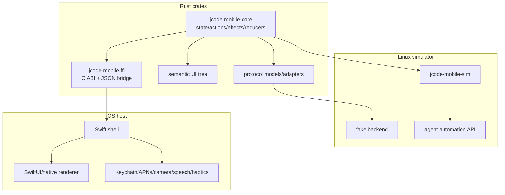

# iOS Host Integration Plan for Rust Mobile Core

This document defines how the Rust-first mobile application core should eventually ship inside the native iOS app while preserving the Linux-native simulator as the primary iteration and regression environment.

Related docs:

- [`MOBILE_AGENT_SIMULATOR.md`](MOBILE_AGENT_SIMULATOR.md)
- [`MOBILE_SWIFT_AUDIT.md`](MOBILE_SWIFT_AUDIT.md)
- [`MOBILE_SIMULATOR_WORKFLOW.md`](MOBILE_SIMULATOR_WORKFLOW.md)
- [`IOS_CLIENT.md`](IOS_CLIENT.md)

## Goal

The iOS application should become a thin host around the same Rust app core used by the Linux simulator.

The shared Rust core should own product behavior:

- app state
- actions
- effects
- reducers/state machines
- protocol event interpretation
- chat/tool/session behavior
- semantic UI tree generation
- replayable transitions

The iOS host should own platform capabilities:

- view/window lifecycle
- touch and keyboard input plumbing
- secure storage implementation
- networking primitive if not Rust-owned
- push notification registration
- camera/photo picker
- microphone/speech integration
- haptics
- OS lifecycle events

## Design principles

1. **Linux simulator first**
   - Every core behavior should be testable without Apple tooling.
   - A new app flow should land in `jcode-mobile-core` and `jcode-mobile-sim` before relying on device testing.

2. **Rust owns behavior, Swift owns platform**
   - Swift should not duplicate reducers, protocol parsing, or chat/tool state transitions.
   - Swift should call into Rust and render/apply returned view-model data.

3. **Stable serialized boundary first**
   - Prefer a JSON/message ABI initially for safety and debuggability.
   - Optimize with typed/binary FFI later only if needed.

4. **One test fixture model**
   - Scenarios used by Linux simulator should be reusable for iOS host smoke tests where feasible.

5. **No hidden iOS-only behavior**
   - If a behavior affects app state, it should be represented as a Rust action/effect and visible to the simulator.

## Target layering



## Proposed crate/module shape

### Existing

- `crates/jcode-mobile-core`
  - shared app state and simulator state seed
  - actions/effects/reducer/store
  - semantic UI tree
  - protocol models

- `crates/jcode-mobile-sim`
  - simulator daemon
  - automation CLI/API
  - scenarios and fake backend later

### Add later

- `crates/jcode-mobile-ffi`
  - `cdylib`/`staticlib` build target
  - C ABI functions
  - opaque app handle
  - JSON request/response bridge
  - panic/error boundary

Possible package settings:

```toml
[lib]
crate-type = ["staticlib", "cdylib", "rlib"]
```

The exact crate type can be refined once the build path is tested on a Mac or CI macOS runner.

## FFI boundary

Use a small C ABI around serialized commands initially.

### Core handle lifecycle

```c
void *jcode_mobile_app_new(const char *initial_scenario_json);
void jcode_mobile_app_free(void *app);
```

### Dispatch and inspect

```c
char *jcode_mobile_dispatch(void *app, const char *action_json);
char *jcode_mobile_state(void *app);
char *jcode_mobile_tree(void *app);
char *jcode_mobile_logs(void *app, uint32_t limit);
void jcode_mobile_string_free(char *ptr);
```

### Platform events

```c
char *jcode_mobile_platform_event(void *app, const char *event_json);
```

Platform events should cover:

- app foreground/background
- network reachability change
- push notification opened
- QR payload scanned
- transcript injected/finalized
- image attachment selected
- secure storage read/write result

### Why JSON first

JSON makes the bridge:

- easy to inspect in Xcode logs
- compatible with simulator traces
- easy to fuzz and replay
- resilient while models are still evolving
- usable by Swift without codegen at the start

Once stable, high-volume paths can move to generated typed bindings.

## Swift host responsibilities

The Swift app should provide:

1. **Renderer host**
   - Render either a SwiftUI view-model derived from Rust or a native/custom renderer surface.
   - Forward user input to Rust actions.

2. **Platform service adapter**
   - Execute Rust effects that require iOS APIs.
   - Return results to Rust as platform events.

3. **Persistence adapter**
   - Store tokens and credentials in Keychain.
   - Store non-secret app preferences in app support/UserDefaults as appropriate.

4. **Networking adapter**
   - Either expose iOS WebSocket/HTTP primitives to Rust as effects, or let Rust own networking with a portable client.
   - The first milestone can keep actual socket primitives in Swift if it keeps the bridge simpler.

5. **Lifecycle adapter**
   - Convert app lifecycle notifications into Rust platform events.

Swift should not own:

- chat message state transitions
- protocol event interpretation
- tool-call state transitions
- session/model state behavior
- pairing validation logic
- semantic node identity

## Effect model

Rust should emit effects that the platform host executes.

Examples:

```json
{ "type": "secure_store_write", "key": "server_token", "value": "..." }
{ "type": "secure_store_read", "key": "server_token" }
{ "type": "http_pair", "host": "...", "port": 7643, "code": "123456" }
{ "type": "websocket_connect", "url": "ws://host:7643/ws", "auth_token": "..." }
{ "type": "register_push_notifications" }
{ "type": "request_camera_qr_scan" }
{ "type": "request_speech_transcript" }
{ "type": "haptic", "style": "success" }
```

The platform returns event results:

```json
{ "type": "secure_store_write_finished", "key": "server_token", "ok": true }
{ "type": "pair_finished", "ok": true, "token": "...", "server_name": "jcode" }
{ "type": "websocket_event", "event": { "type": "text_delta", "text": "hello" } }
{ "type": "qr_payload_scanned", "payload": "jcode://pair?..." }
{ "type": "speech_transcript", "text": "run tests", "is_final": true }
```

The Linux simulator fake backend should be able to produce the same event shapes.

## iOS rendering strategy

There are two viable stages.

### Stage 1: SwiftUI host rendering Rust view-models

Rust produces a semantic/view-model tree. Swift renders it with SwiftUI components.

Pros:

- fastest path to a working iOS host
- easy to integrate platform sheets/pickers
- preserves native text input and accessibility early

Cons:

- Swift still owns visual layout details
- visual fidelity with Linux simulator requires discipline

### Stage 2: Shared renderer or stricter layout model

Rust owns more layout/rendering data, and both Linux simulator and iOS host render from the same layout model.

Pros:

- stronger fidelity between simulator and device
- better screenshot/layout regression story

Cons:

- more implementation cost
- text input, accessibility, and platform controls need careful bridging

Recommendation: start with Stage 1, but design semantic node IDs and effects as if Stage 2 will happen.

## Build and packaging path

Initial target flow:

1. Add `jcode-mobile-ffi` crate.
2. Build Rust static library for iOS targets:
   - `aarch64-apple-ios`
   - `aarch64-apple-ios-sim`
   - optionally `x86_64-apple-ios` if older simulator support is needed
3. Generate C header with `cbindgen` or maintain a small manual header.
4. Wrap library/header in an XCFramework.
5. Add XCFramework to the Xcode project/Swift package.
6. Swift calls the C ABI through a small `RustMobileCore` wrapper.

Example future commands, to be validated on macOS:

```bash
rustup target add aarch64-apple-ios aarch64-apple-ios-sim
cargo build -p jcode-mobile-ffi --target aarch64-apple-ios --release
cargo build -p jcode-mobile-ffi --target aarch64-apple-ios-sim --release
```

Then package with `xcodebuild -create-xcframework`.

## Testing strategy

### Linux required before iOS

Every new app behavior should have at least one of:

- `jcode-mobile-core` reducer/protocol test
- `jcode-mobile-sim` automation test
- replay/golden test once available

### iOS smoke tests later

iOS host tests should validate bridge correctness, not duplicate every core test:

- app handle creates successfully
- scenario loads
- tree/state can be read
- Swift action dispatch reaches Rust
- Rust effect reaches Swift adapter
- Swift platform result reaches Rust
- credentials use Keychain adapter

### Fixture parity

The same scenarios should be loadable in:

- Linux simulator daemon
- Rust unit tests
- iOS bridge smoke tests

## Migration plan

### Phase 0: Current state

- Swift app shell and SDK exist.
- Rust simulator core exists but is still a simplified flow.
- Linux simulator can drive and assert basic onboarding/chat states.

### Phase 1: Stabilize Rust app core

- Rename/refactor simulator state toward real app concepts.
- Port protocol event interpretation from Swift to Rust.
- Port chat/tool/session reducers.
- Keep simulator green.

### Phase 2: Add FFI crate

- Expose app handle lifecycle.
- Expose JSON dispatch/state/tree/logs APIs.
- Add panic-safe error handling.
- Test from a tiny C or Swift harness.

### Phase 3: Swift wrapper

- Add a small Swift `RustMobileCore` wrapper.
- Replace `AppModel` behavior with calls into Rust.
- Keep SwiftUI views as renderer shell.
- Platform APIs return events to Rust.

### Phase 4: Shared fixtures

- Load simulator scenarios through the iOS host in debug builds.
- Add one or two iOS smoke tests for bridge parity.

### Phase 5: Deeper renderer parity

- Add layout/screenshot export in Linux simulator.
- Align SwiftUI/native renderer output with Rust semantic/layout data.
- Introduce image/layout diff tests where stable.

## Open decisions

- Whether Rust or Swift owns actual WebSocket/HTTP transport in the first iOS bridge.
- Whether to use manual C ABI, `uniffi`, or another binding generator after the JSON bridge stabilizes.
- How much layout should Rust own before the first TestFlight build.
- Whether the SwiftUI renderer is a long-term shell or a temporary bridge.
- Where to store non-secret simulator-compatible preferences on iOS.

## Success criteria

M16 is complete when:

- iOS host responsibility boundaries are documented.
- The FFI shape is documented.
- The platform effect/event model is documented.
- Build/package path is documented.
- Testing and fixture parity strategy is documented.
- Migration phases from Swift-owned behavior to Rust-owned behavior are clear.
